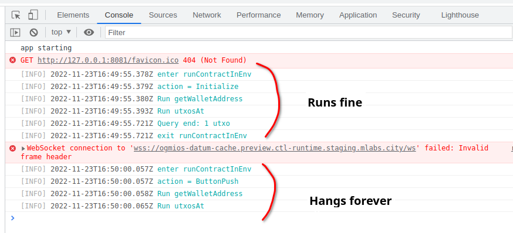

# Halogen + CTL issue

- When Contract is run a result of `Initialize` action, it runs fine (1st block in the screenshot).

- When Contract is run as reaction to button press (`ButtonPush` action), `utxosAt` call hangs forever.



## Build

- With Nix: `nix run .#odc-mre-serve`

- With Spago:

  In `nix develop .#offchain`:

  ```sh
  cd offchain
  ./src/assets/bundle.sh && http-server -a 127.0.0.1 -p 8081 dist/
  ```

#### Open http://127.0.0.1:8081 and trigger failing `utxosAt` by pressing the button
